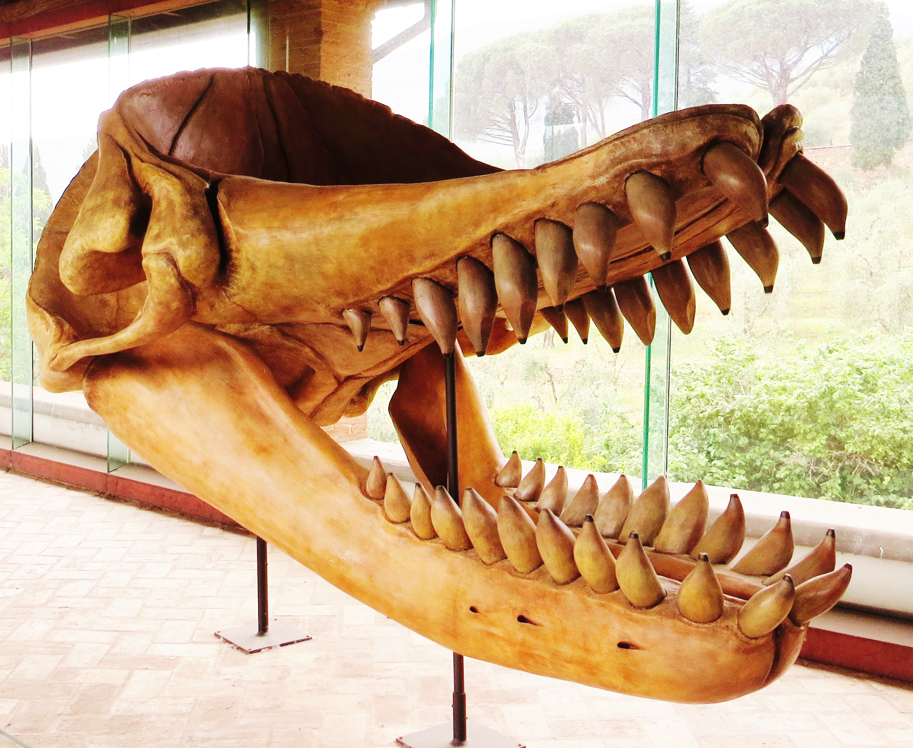

## Biography

**Yuqing Lu** is an undergrad student at UC Berkeley, studying Applied Mathematics. I chose Data Science as my elective cluster and I want to pursue a higher degree in Data Science after graduation.
 

## Skills

I'm comfortable with Python and learning Java and R this semester.

## Awesome Animal Pick

I choose the [Sperm Whale](https://en.wikipedia.org/wiki/Sperm_whale), because it's cute and I think it's cool to "patrol" the deep sea like a submarine!

## Animal Family Member

The sperm whale is a member of the superfamily [Physeteridae](https://en.wikipedia.org/wiki/Physeteridae), which also includes the pygmy and dwarf sperm whales. This superfamily is unique because its members cannot move their eyes in their eyesockets! This is probably because they primarily use echolocation, not sight, to navigate the seas.

Below is a photo of the skull of an extinct Physeteridae family member, Livyatan melvillei, whose name comes from the sea monster Leviathan.

## References

1. Sperm Whale Img 1 [life of animals; the mammals, 1852](https://oceanwide-expeditions.com/to-do/wildlife/sperm-whale): [Link to page](https://oceanwide-4579.kxcdn.com/uploads/media-dynamic/cache/widen_1100/uploads/media/default/0001/18/thumb_17956_default_1600.jpeg)

2. Livyatan melvillei skull Img 1 [Wikipedia](https://commons.wikimedia.org/wiki/File:Livyatan_melvillei_skull.jpg)
